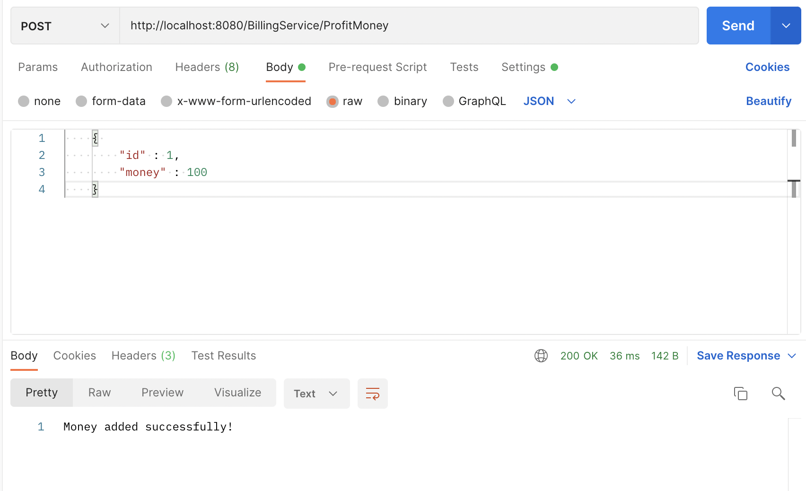
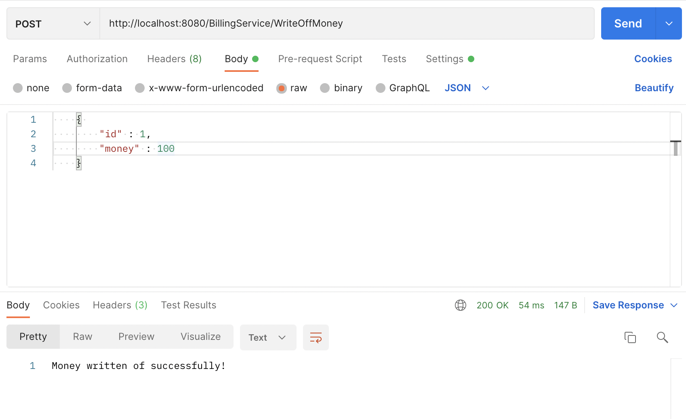
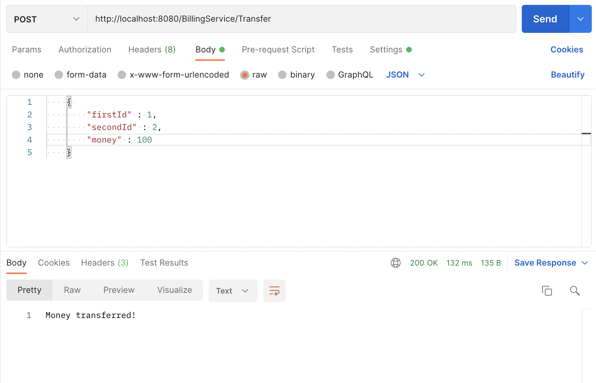
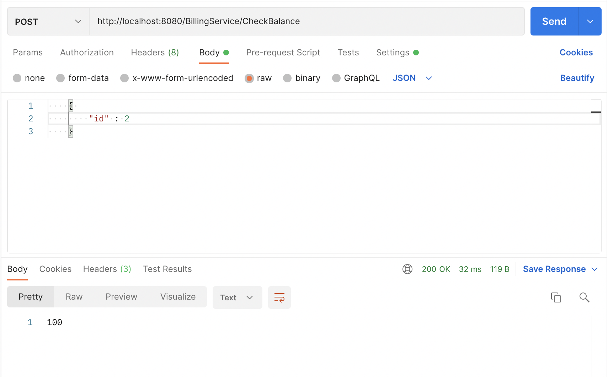
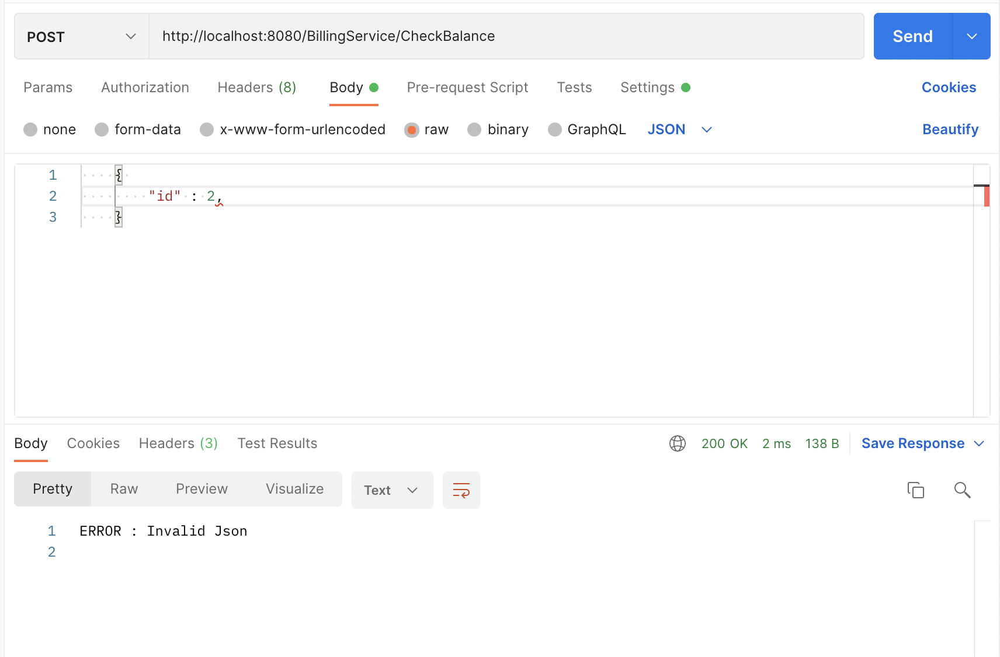

# Запуск:

1. Установить PostgreSQL

2. git clone https://github.com/EminZalaev/avitotechtask

3. Выполнить скрипты для таблицы в файле sql/sqlScript.sql

4. В файле /pkg/config/config.go ввести данные PostgreSQL (хост, порт и тд)

5. go run main.go

# HTTP Запросы:

http://localhost:8080/BillingService/ProfitMoney : Начисление по id

Пример JSON :

        {
            "id" : 1,
            "money" : 200
        }
    
Результат :
   
Money added successfully!

----------------------------------------------------------------------------------------

http://localhost:8080/BillingService/WriteOffMoney : Списание по id

Пример JSON :

        {
            "id" : 2,
            "money" : 100
        }
    
Результат в случае успеха :

Money written of successfully!

Результат в случае когда недостаточно средств на балансе :

ERROR : Not enough money

----------------------------------------------------------------------------------------

http://localhost:8080/BillingService/Transfer : Перевод по id от одного человека другому

Пример JSON :

        {
            "firstId" : 2,
            "SecondId" : 3,
            "money" : 100
        }
    
Результат :

Money written of successfully!

Результат в случае когда недостаточно средств у того, кто хочет перевести деньги : 

ERROR : Not enough money

--------------------------------------------------------------------------------------------

http://localhost:8080/BillingService/CheckBalance : Проверка баланса

Пример JSON :

        {
            "id" : 2
        }
    
Результат :

<Баланс пользователя>

-------------------------------------------------------------------------------------------

Для всех случаев при запросе невалидного JSON :

ERROR : Invalid Json

